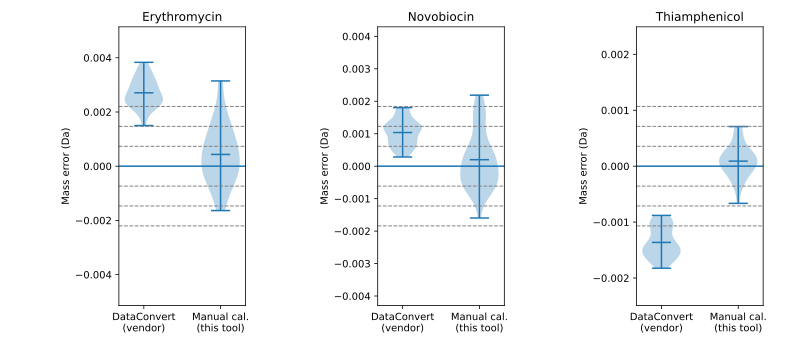
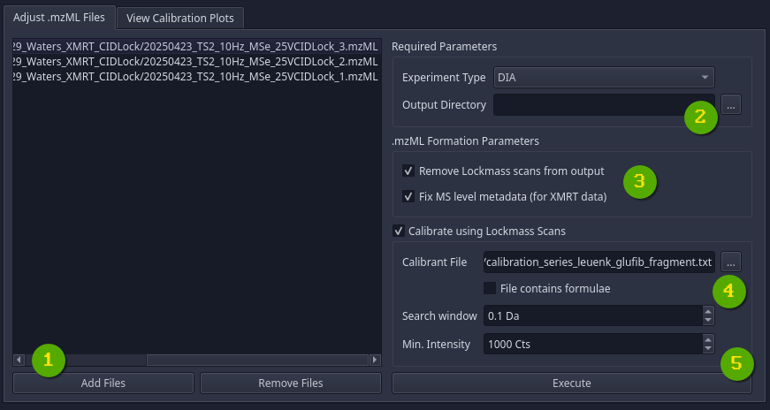
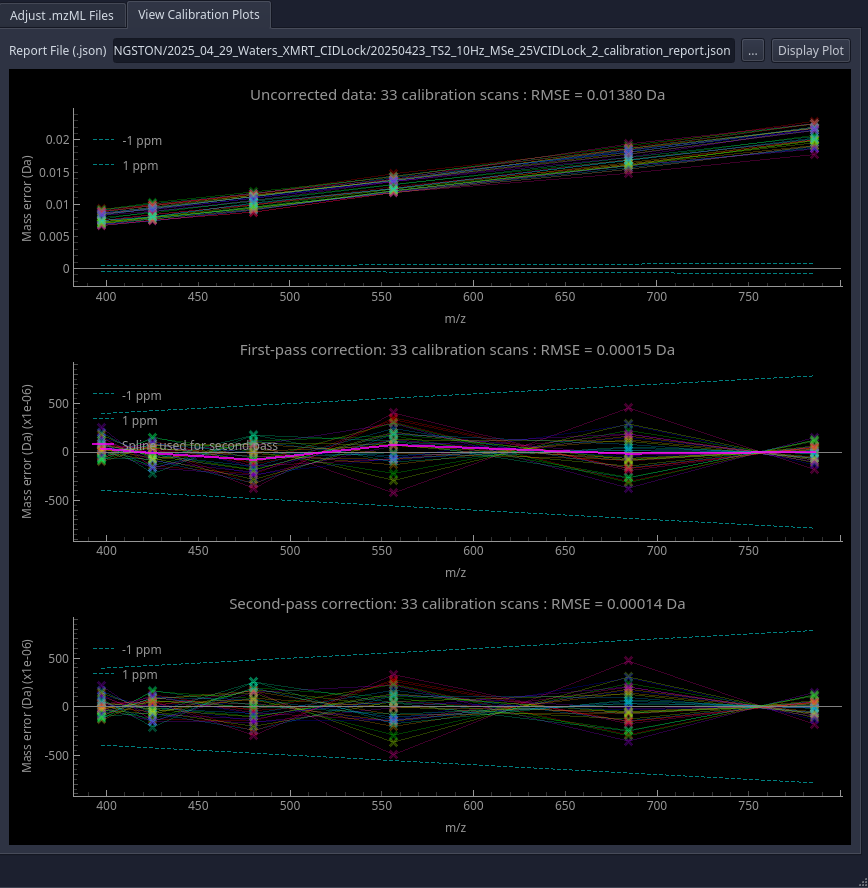

# Waters MzML Tool

This is a CLI/GUI tool for re-calibrating Waters `.mzML` files, as well as 
fixing incorrect metadata generated when exporting `.mzML` files from a 
XevoMRT instrument.


## Why re-calibrate?

*Generated from an LC/MS dataset acquired on the Xevo XMRT, which is specc'd for 0.5 ppm RSME*

The .mzML files exported using Waters' default software leaves a lot on the table. This tool allows users
to calibrate using an arbitrary number of calibrants


## How to: retain lockmass scans when exporting from Waters instruments

This section is not exhaustive. I've tested `.mzML` exports on two Waters 
instruments: Synapt G2-Si, and Xevo MRT.

- Obtain `.raw` data file (i.e. 'MassLynx format')
  - If using a Xevo MRT, this can be generated using '*DataConvert*'
- Use `MSConvert` with the following parameters:
    ```bash
    msconvert /raw/data/file.raw --filter "peakPicking vendor"
    ```
- This generates `.mzML` files that still have the lockmass scans included 

*Note*: Converting the Xevo MRT's `.raw` files into `.mzML`s inadvertently sets 
all scans to be incorrectly labeled as `ms_level = 1`. This tool can fix that.


## How to: apply double lockmass correction



1. Click 'Add Files'/'Remove Files' and select `.mzML` files prepared as per the
    previous section. It's critical that these files still have the 
    lockmass scans in them.
2. (*Optional*), select a directory to save the modified `.mzML` files. If no directory is
    selected, the output will be saved in the same directory as the input, but with a different
    file name.
3. These options control whether the lockmass scans are to be retained in the final output.
   If you are processing Xevo MRT data, enable '*Fix MS level metadata*'
4. Specify calibration parameters, including:
   - The path to a `.txt` file containing calibrant masses on each line. The masses can either
      be given as m/z values, or as molecular formulae (i.e `C28H37N5O7H+`). If using formulae, remember to include
      the charge.
   - The m/z tolerance and minimum intensity to use when searching for calibrants
5. Click '*Execute*' to run the program.

## Inspecting calibration curves


Whenever this program performs a calibration, a `_calibration_report.json` file is saved in the same
directory as the `.mzML` file. In the '*View Calibration Plots*' tab, the user can open these `.json` files
to generate plots of the calibration performance.


## CLI Usage

The progam also has a command-line interface, and can be called directly from the command-line:
```bash
$ ./waters_mzml_tools --help
```

```
usage: waters_mzml_tools [-h] [--gui] [--input INPUT] [--experiment-type {dda,dia}] [--add-ms-levels] [--output OUTPUT] [--calibrants CALIBRANTS] [--formulae] [--calibrant-window CALIBRANT_WINDOW]
                         [--calibrant-min-intensity CALIBRANT_MIN_INTENSITY] [--remove-calibration-scans] [--show-calibration-plot]

Tool for manually calibrating Waters .mzML files. Can also be used to fix mis-formed .mzML files generated by Xevo MRT instruments

options:
  -h, --help            show this help message and exit
  --gui                 Launch GUI mode. All subsequent arguments will be ignored
  --input INPUT, -i INPUT
                        Input .mzML file, or alternatively, a report .JSON file. If a .json file is passed, will display calibration plots If this argument is not given, the program launches in GUI mode.
  --experiment-type {dda,dia}
                        Type of experiment ("dda" or "dia"). Note: dda not yet implemented
  --add-ms-levels       Add MS level tags based on the spectra native IDs. This is needed because converting XMRT data into .RAW then .mzML strips out MS level information
  --remove-calibration-scans
                        Removes the "lockmass" scans from final output

Output Directory:
  --output OUTPUT       (Optional) Select directory to save output. If not provided, will save output files in same directory with a different name

Calibration:
  Calibrate .mzML file using lockmass scans

  --calibrants CALIBRANTS, -c CALIBRANTS
                        If provided, applies calibration. Specifies location of .txt file containing calibrant m/z values or formulae
  --formulae, -f        Calibrant list contains formulae rather than m/z values. If this flag is provided, the program will calculate the expected m/z values. Remember to include charge.
  --calibrant-window CALIBRANT_WINDOW, -cw CALIBRANT_WINDOW
                        The window (in Da) for which to search for a calibrant signal. Default is 0.1
  --calibrant-min-intensity CALIBRANT_MIN_INTENSITY, -ci CALIBRANT_MIN_INTENSITY
                        The minimum signal intensity at which a calibrant is considered. Default is 1e3
  --show-calibration-plot
                        Show a calibration plot after correcting the .mzML file

```

